# Table of contents
* [Purpose](#purpose)
* [User Experience](#user-experience)
  * [User Stories](#user-stories) 
  * [Design](#design)
* [Features](#features)
  * [Existing Features](#existing-features)
  * [Features Left To Implement](#features-left-to-implement)
* [Technologies](#technologies)
* [Testing](#testing)
  * [Validator Testing](#validator-testing)
  * [Manual Testing](#manual-testing)
  * [Bugs](#bugs)
* [Deployment](#deployment)
* [Credits](#credits)

# Milestone Project 4 - Guild Wars 2 Blog
## Purpose

This website was created to complete the fourth Milestone Project for Code Insitute's Full Stack Software Developer course. I built this from the ground up using knowledge I gained from the previous modules. The objective of this project is to showcase my ability to create a true Full Stack application using the Django framework. The full list of technologies used can be found in the 'Technologies' section further down.

Users of this website are able to create, read, update and delete posts discussing the PC game 'Guild Wars 2'.

You can find the link to the live website right [here]
Please note: To open the links in this document in a new browser tab, please hold CTRL + Click the link.

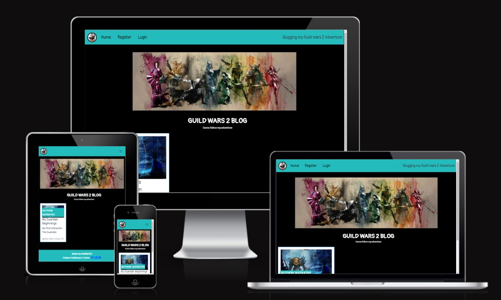

***

# User Experience
## User Stories
### First Time User Goals
<details><summary>First Time User Goals</summary>

* As a First Time User, I clearly understand the main objective of the website.
* As a First Time User, I can easily navigate through the website.
* As a First Time User, I can register an account to gain full access to the website.
* As a First Time User, I can view more from the game.
* As a First Time User, I can choose a post I would like to inspect further.
</details>
<details><summary>Frequent User Goals</summary>

* As a Frequent User, I can log in to gain access to my account.
* As a Frequent User, I can comment on a blog post with my thoughts on the subject.
* As a Frequent User, I can like a post to show that I enjoyed it.
* As a Frequent User, I can change aspects of my personal account details.
* As a Frequent User, I can change my password in case there was a security risk.
</details>

<details><summary>Admin User Goals</summary>

* As an Admin, I can create, read, update and delete posts so that I can manage my blog content.
* As an Admin, I can create draft posts so that I can finish writing the content later.
* As an Admin, I can approve or disapprove comments so that I can filter out objectionable comments.
</details>

***
## Design

<details>
<summary>Wireframes</summary>

* Home Page Desktop + Mobile:

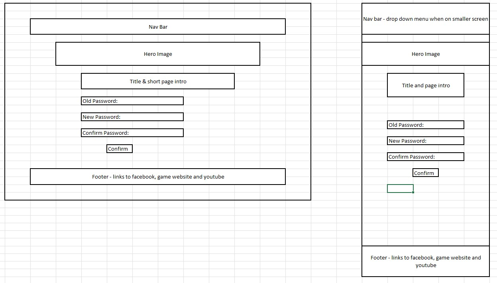

* Create a Post:

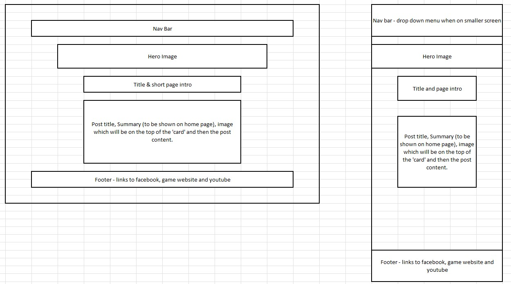

* Edit Profile:

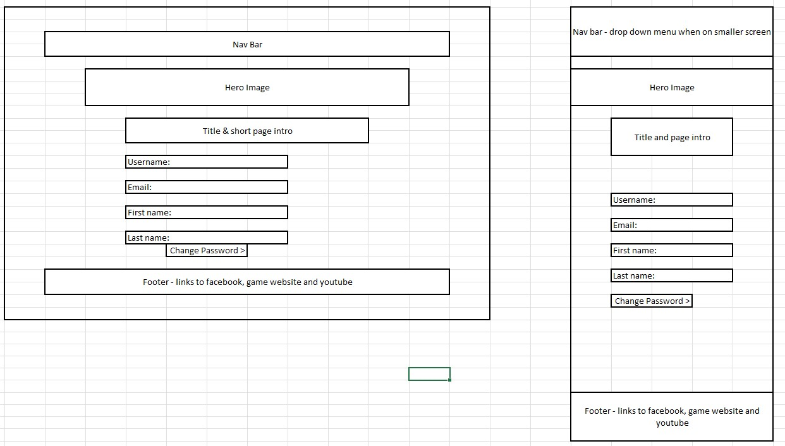

* Log In:

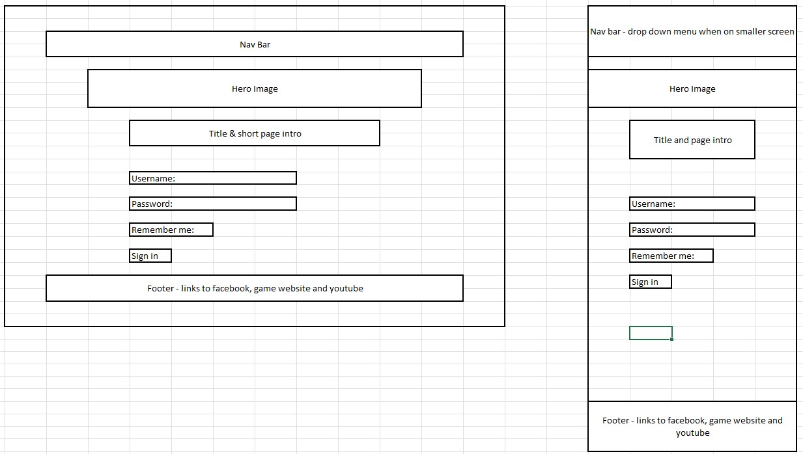

</details>

<details><summary>Images</summary>
The images you first see when you connect to the website are of varying style. Most of the photos you will see are uploaded by the user, but the header image will always be as shown below. This is also used as the placeholder image when a user chooses to not upload a photo to their post.


</details>

<details><summary>Colour Scheme</summary>
Four colours are used in this website, these are #23BBBB, #F9FAFC, #313132 and black. The background, text and foreground colours have a sufficient contrast ratio to aid with accessibility and visibility.

</details>

# Features
## Existing Features
<details><summary>Home Page</summary>
 
The users are greeted to the website by the Home Page. This is where you will find everything you need to navigate the website.

The purpose of the Home Page is to fulfill the following user stories:
```
As a First Time User, I clearly understand the main objective of the website.
```
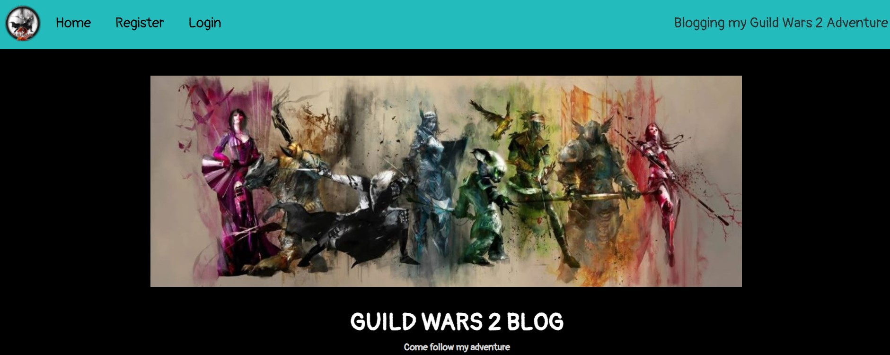
 
</details>

<details><summary>Navigation Bar</summary>
 
Featured at the top of all pages is the navigation bar, holding the Guild Wars 2 thumbnail logo and all links to the home page, register and login pages.

The purpose of the navigation bar is to fulfill the following user stories:
```
As a First Time User, I can easily navigate through the website.
```
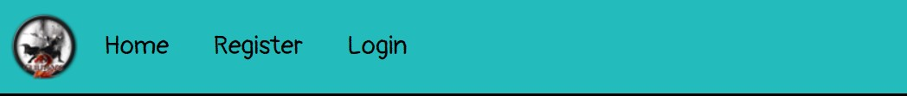

Using Bootstrap I have used .navbar-toggler class to make the navigation bar more user friendly on smaller screens.

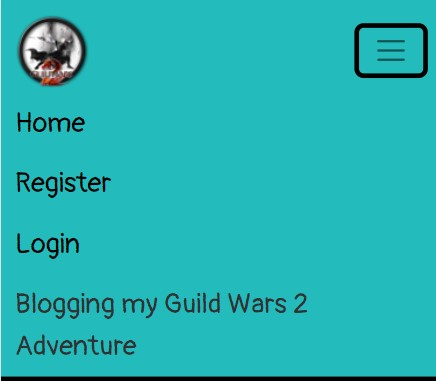

</details> 

<details><summary>Footer</summary>
 
Featured at the bottom of all pages is the footer, holding links to places where Guild Wars 2 is featured, such as Facebook, the Guild Wars 2 website and their YouTube account.

The purpose of the footer is to fulfill the following user stories:
```
As a First Time User, I can view more from the game.
```

 
</details>

<details><summary>Post Detail</summary>
 
When one of the posts on the home page is clicked, the user is taken to post detail view. Here the user can see the author, date/time the content was posted and the content itself (during the testing stage, I noticed Daylight Savings isn't taken into account when logging the time and date the content was posted).

The purpose of the post detail is to fulfill the following user stories:
```
As a First Time User, I can choose a post I would like to inspect further.
```
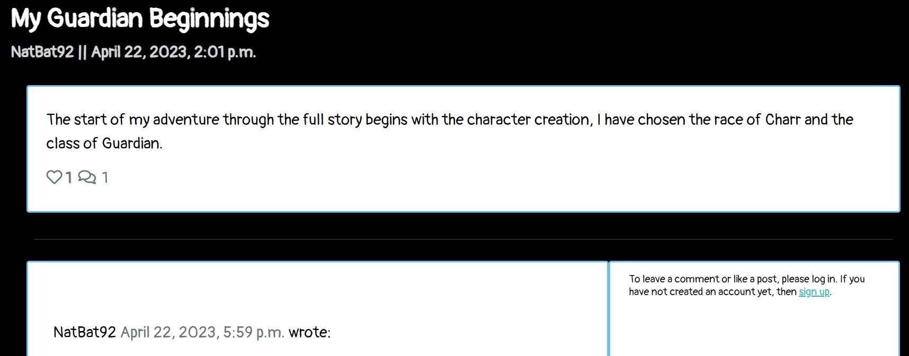
 
</details>

<details><summary>Like/Unlike</summary>
 
Just below the post itself, two icons are visible. One of these being a clickable 'Like' (small heart icon) button that can only be interacted with when the user has logged into their account. The user can click the 'Like' a second time to unlike the post.The second icon shows the amount of comments the post has received.

The purpose of the Like/Unlike feature is to fulfill the following user story:
```
As a Frequent User, I can like a post to show that I enjoyed it.
```

</details>

<details><summary>Post Comments</summary>
 
At the bottom of the post is the comments section, this is where the user is able to write and post a comment on the blog post.

The purpose of the post comments feature is to fulfill the following user story:
```
As a Frequent User, I can comment on a blog post with my thoughts on the subject.
```
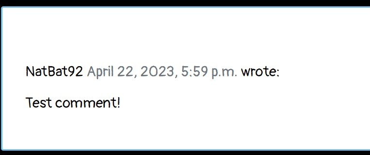

When the user has posted a comment, an alert replaces the text field letting them know that their comment is awaiting inspection and approval.

The purpose of the comment approval feature is to fulfill the following user story:
```
As an Admin, I can approve or deny comments, this allows me to filter out objectionable/inappropriate comments.
```
 
</details>

<details><summary>Add Post</summary>
 
This page of the website allows the user to create their own blog post. I implemented a rich text editor which allows the user to add a bit more style to their post. For security reasons, I have to give the user staff privileges to be able to post, which is common practice in other professional websites. This is for user management purposes to ensure that only validated users can post and blog about Guild Wars 2 on my website. It also acts as a security feature, preventing racist/discriminating posts.

The purpose of this is to fulfill the following user stories:
```
As a Frequent User, I can create my own blog post and post it on the website.
```
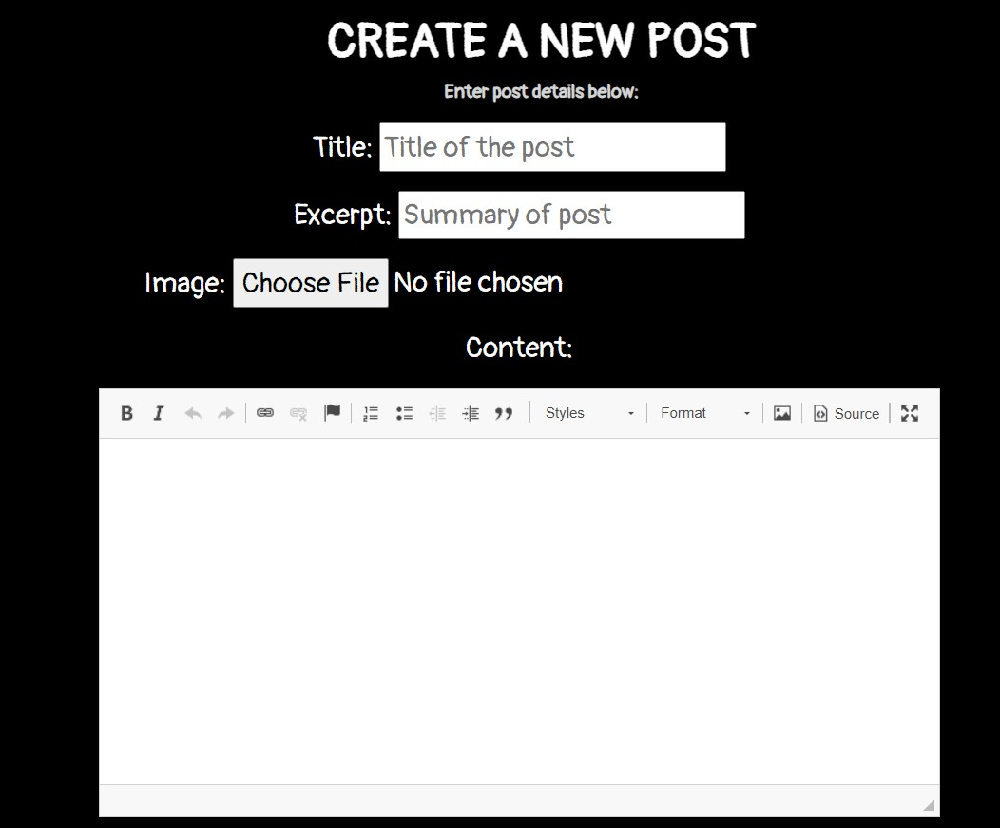

</details>

<details><summary>Edit/Delete Post</summary>
 
If the user is the author of the post, two buttons appear on the post detail section. These buttons give them the ability to edit or delete the post. This is to aid the user in correcting issues with the post, or just to delete it and start again.

The purpose of this function is to fulfill the following user stories:
```
As a Frequent User, I can edit or delete my own posts.
```

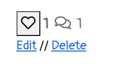

When the user clicks the delete button they are taken to a new page with a warning, making sure they are aware that they are about to permanently delete the post. This is so if they change their mind and want to keep it, they can.

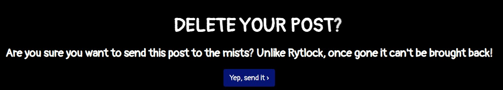

</details>

<details><summary>Register</summary>
 
If a visitor likes the website and wishes to utilise all of the features, they are able to register an account. This enables the user to be able to like and comment on posts.

The purpose of this is to fulfill the following user stories:
```
As a First Time User, I can register an account to gain full access to the website.
```
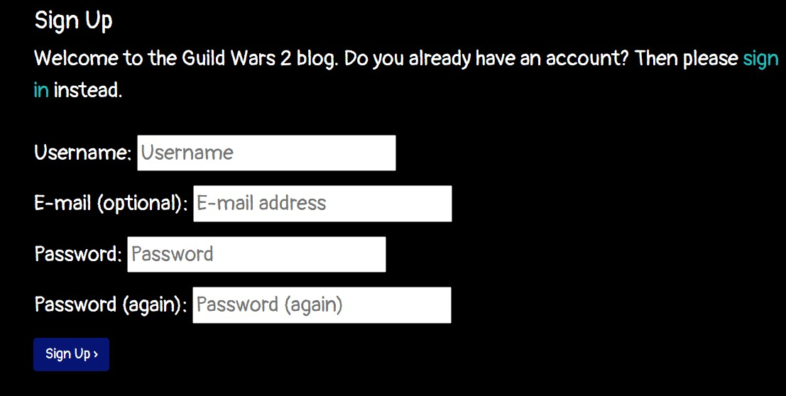

</details>

<details><summary>Log In</summary>
 
When the user returns to the website, after previously visiting the website and creating an account, they are able to log back into their account to see if any more blog posts have been created.

The purpose of this is to fulfill the following user stories:
```
As a Frequent User, I can log in to gain access to my account.
```
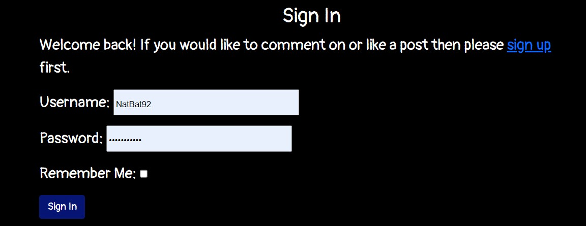

</details>

<details><summary>Edit Profile</summary>
 
This page of the website enables the user to edit specific areas regarding their account. The following can be edited:
* Username
* Email
* First Name
* Last Name

The purpose of this is to fulfill the following user stories:
```
As a Frequent User, I can change aspects of my personal account details.
```
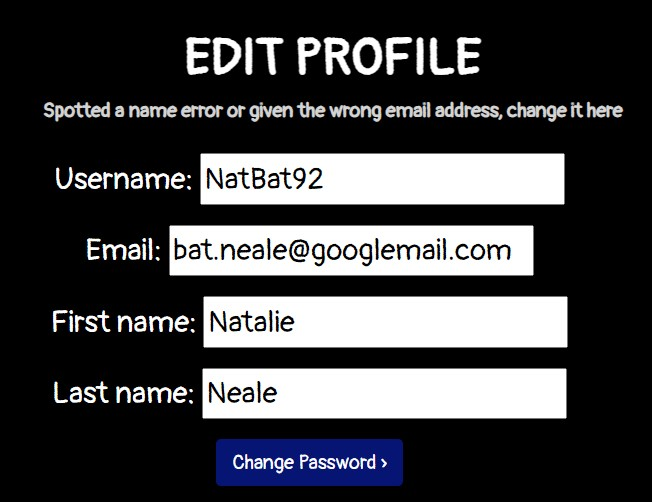

</details>

<details><summary>Change Password</summary>
 
Within the Edit Profile page, the user also has the option to click a link to take them to a page allowing them to change their password. 

The purpose of this is to fulfill the following user stories:
```
As a Frequent User, I can change my password incase their is a security risk.
```
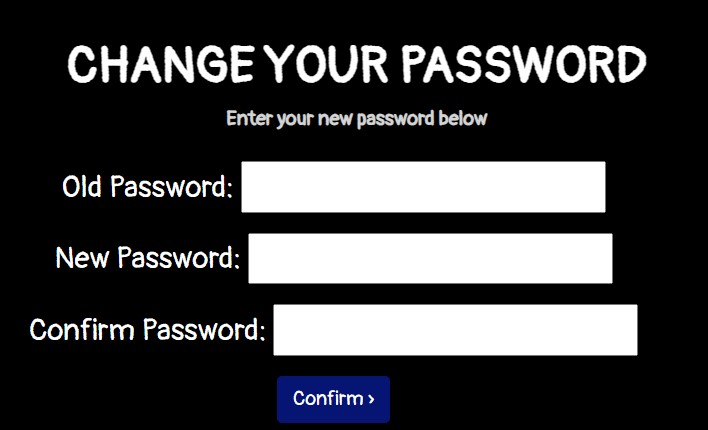

When the user has confirmed their new password, they are taken to a page informing them that the change was successful.

</details>

## Features Left to Implement

<details><summary>Password Reset</summary>
I would like to implement a password reset feature. This would send an email to the users associated email address with a temporary password. They could then use the temporary password to gain access to their account and change their password manually.
</details>

<details><summary>Contact Us</summary>
I would also like to create and implement a 'Contact Us' page. Users would be able to send enquiries to me via a form.
</details>

<details><summary>Reply to comments</summary>
I would like to add a feature that allows the user to reply to comments on a post. This could be a reply in a thread format or something else entirely. This would add a personal touch to the comments section, enabling users to interact with one another.
</details>

***

# Technologies

* [HTML](https://en.wikipedia.org/wiki/HTML)
* [CSS](https://en.wikipedia.org/wiki/CSS)
* [JavaScript](https://en.wikipedia.org/wiki/JavaScript)
* [Django](https://en.wikipedia.org/wiki/Django_(web_framework))
* [Bootstrap](https://en.wikipedia.org/wiki/Bootstrap_(front-end_framework))
* [Heroku](https://dashboard.heroku.com/)
    * Heroku is the site used to deploy the project.
* [GitHub](https://github.com/)
    * GitHub is the hosting site I used to store the code for the website.
* [GitPod](https://gitpod.io/)
    * GitPod is the Integrated Development Environment used to develop the website in a browser.
* [Font Awesome](https://fontawesome.com/)
    * Font Awesome icons are used for the social media links located in the Footer section of the website.
* [Google Fonts](https://fonts.google.com/)
    * Google fonts are used in the project to import the **Pangolin** font.
* [Am I Responsive?](http://ami.responsivedesign.is/)
    * Am I Responsive is used to generate the website mock up.
* [Chrome Developer Tools](https://developer.chrome.com/docs/devtools/)
    * The built in developer tools in Google Chrome are used to test CSS styles, inspect page elements and help with debugging problems with the layout of the website.
* [Stack Overflow](https://stackoverflow.com/)
    * Stack Overflow was the primary source for help regarding issues.
* [W3 Schools](https://www.w3schools.com/)
    * W3 Schools was one of the websites used for resolving issues with code.

***

# Testing

## Validator Testing

### Code Validation

To ensure all code for the Guild Wars 2 blog was correct, validation through various validators was performed. The results are listed below.

* HTML Validation

  All HTML code was checked with the [W3C Markup Validation Service](https://validator.w3.org/).

   <details>
   <summary>Home Page</summary>

   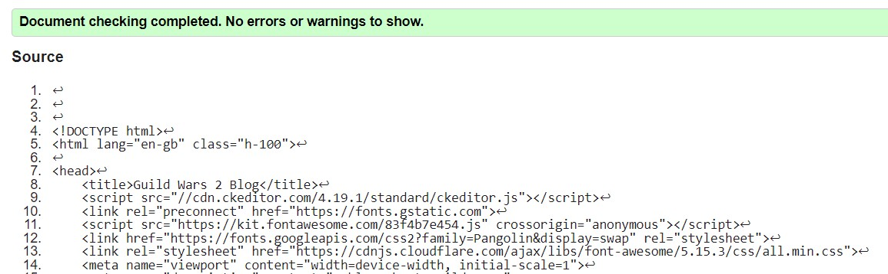

   </details>
   <details>
   <summary>Add Post</summary>

    One error returned. As seen in the code below, I have had to use {{ form.as_p }} to get the rich text editor to function correctly. As of right now I am unsure of a solution.

   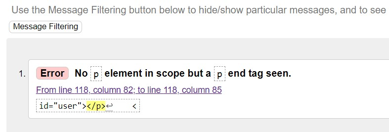

   </details>
   <details>
   <summary>Sign Up</summary>

   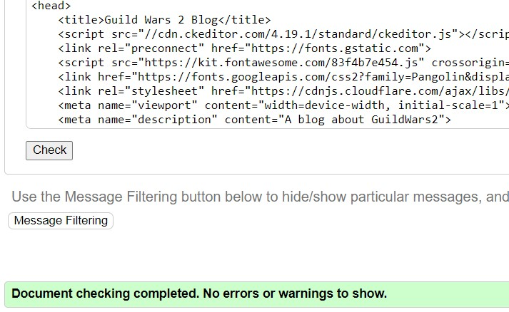

   </details>
   <details>
   <summary>Log In</summary>

   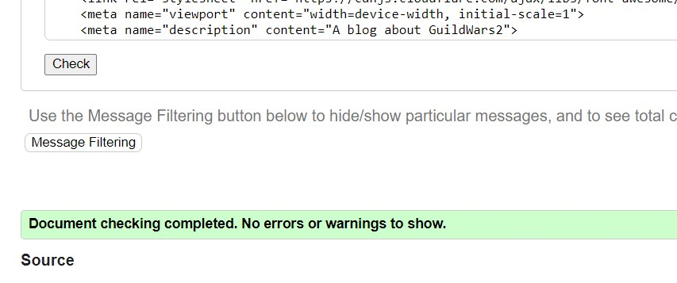

   </details>
   <details>
   <summary>Edit Profile</summary>

   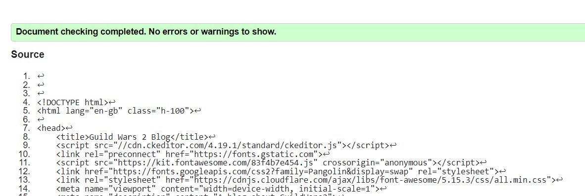

   </details>
   <details>
   <summary>Log Out</summary>

   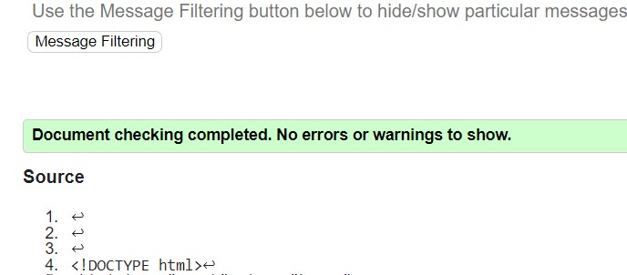

   </details>
   
* CSS Validation

  All CSS code was checked with the [W3C CSS Validation Service](https://jigsaw.w3.org/css-validator/).

   <details>
   <summary>CSS Results</summary>

   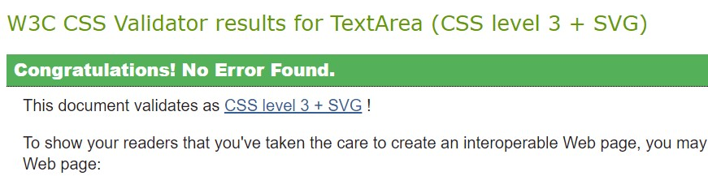

   </details>
   
* Python Validation

  All Python code was checked with the Code Institutes Python linter.

  <details>
  <summary>admin.py</summary>

  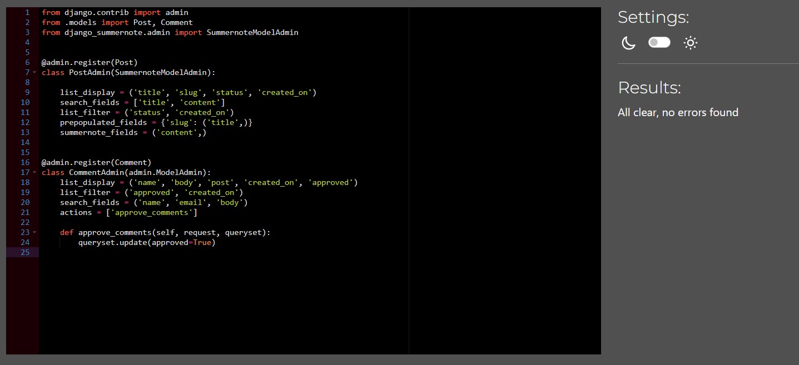

  </details>
  <details>
  <summary>views.py</summary>

  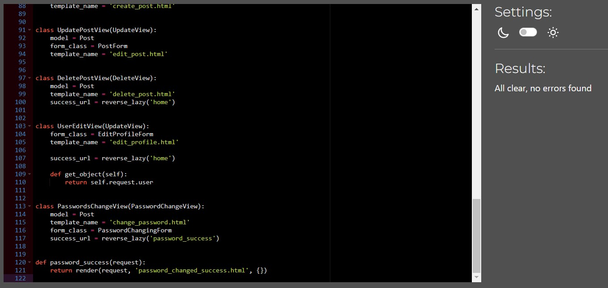

  </details>
  <details>
  <summary>forms.py</summary>

  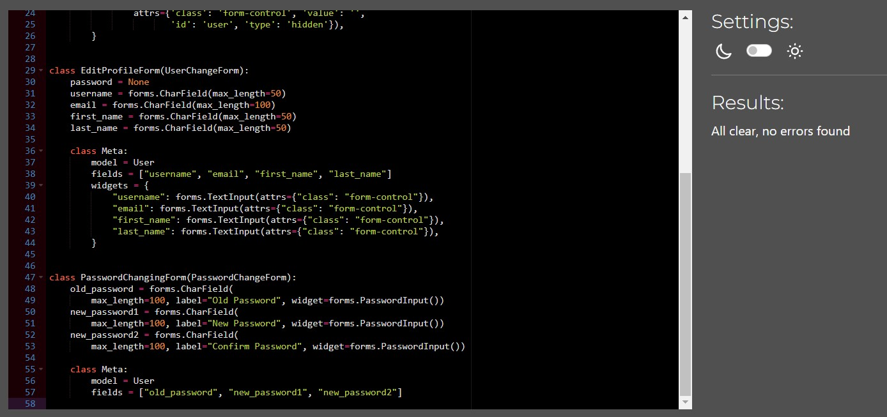

  </details>
  <details>
  <summary>models.py</summary>

  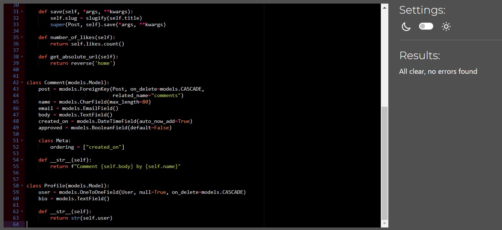

  </details>
 
* Accessibility

  The websites accessibility was tested with lighthouse in the Dev tools.

  <details>
  <summary>Lighthouse Summary</summary>

  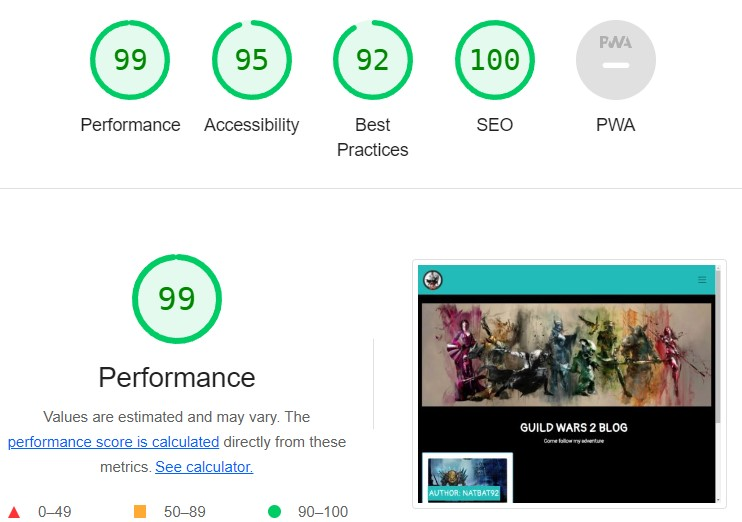

  </details>

## Manual Testing

  I tested that the website is responsive, functions well and looks good on all screen sizes using Google Dev Tools.

  <details><summary>Google Doc</summary>

  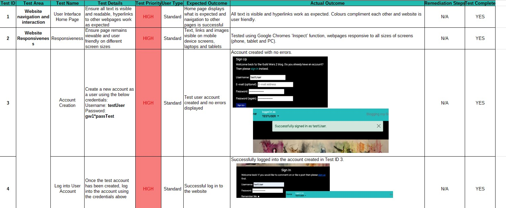
  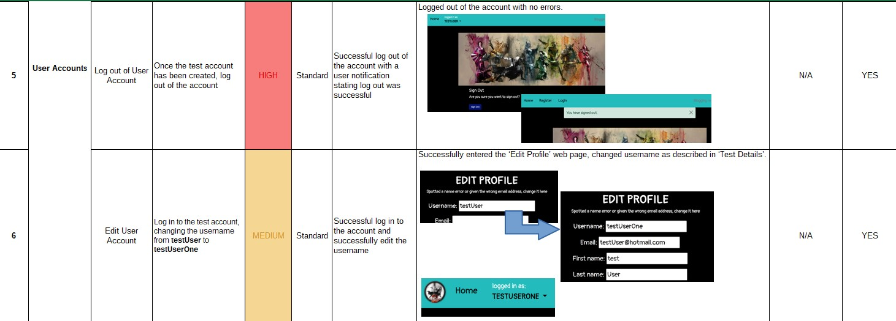

  There are more tests that I completed and I can make the spreadsheet available to those who wish to see it.

  </details>

***

## Bugs

The main bug I came across was on the 'Create a Post' page. The CKeditor field failed to show on the page when the project had been deployed. After researching extensively online and testing various possible solutions, this was solved by adding a javascript script to the top of the base html page.

***

# Deployment

 This project was deployed using Code Institute's mock terminal for Heroku.
* Fork or clone this repository
* Create a new Heroku app
* Set the buildpacks to Python and NodeJS in that order
* Link the Heroku app to the repository
* Click on Deploy

***

# Credits

I would like to thank my mentor, Andre, for his help in identifying improvements for my code. Also, my partner Emma for taking the time to test my project so I could document the things she found.